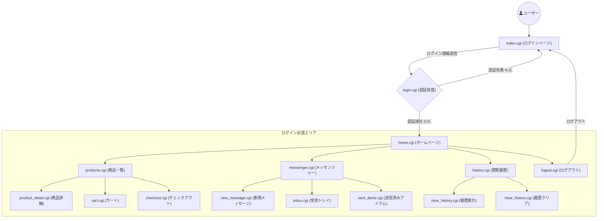

```mermaid
graph TD
    %% Start Node
    Start((fa:fa-user ユーザー)) --> LoginPage["index.cgi (ログインページ)"];

    %% Login Process
    LoginPage -- ログイン情報送信 --> LoginProcess{"login.cgi (認証処理)"};
    LoginProcess -- 認証成功 O.K. --> HomePage["home.cgi (ホームページ)"];
    LoginProcess -- 認証失敗 N.G. --> LoginPage;

    %% Authenticated Area (Subgraph)
    subgraph "ログイン必須エリア"
        direction TB

        %% Main Navigation from Home
        HomePage --> ProductsPage["products.cgi (商品一覧)"];
        HomePage --> MessengerPage["messenger.cgi (メッセンジャー)"];
        HomePage --> HistoryPage["history.cgi (閲覧履歴)"];
        HomePage --> LogoutPage["logout.cgi (ログアウト)"];

        %% Products Page Navigation
        ProductsPage --> ProductDetailPage["product_detail.cgi (商品詳細)"];
        ProductsPage --> CartPage["cart.cgi (カート)"];
        ProductsPage --> CheckoutPage["checkout.cgi (チェックアウト)"];

        %% Messenger Page Navigation
        MessengerPage --> NewMessagePage["new_message.cgi (新規メッセージ)"];
        MessengerPage --> InboxPage["inbox.cgi (受信トレイ)"];
        MessengerPage --> SentItemsPage["sent_items.cgi (送信済みアイテム)"];

        %% History Page Navigation
        HistoryPage --> ViewHistoryPage["view_history.cgi (履歴表示)"];
        HistoryPage --> ClearHistoryPage["clear_history.cgi (履歴クリア)"];
    end

    %% Logout Process
    LogoutPage -- ログアウト --> LoginPage;
```