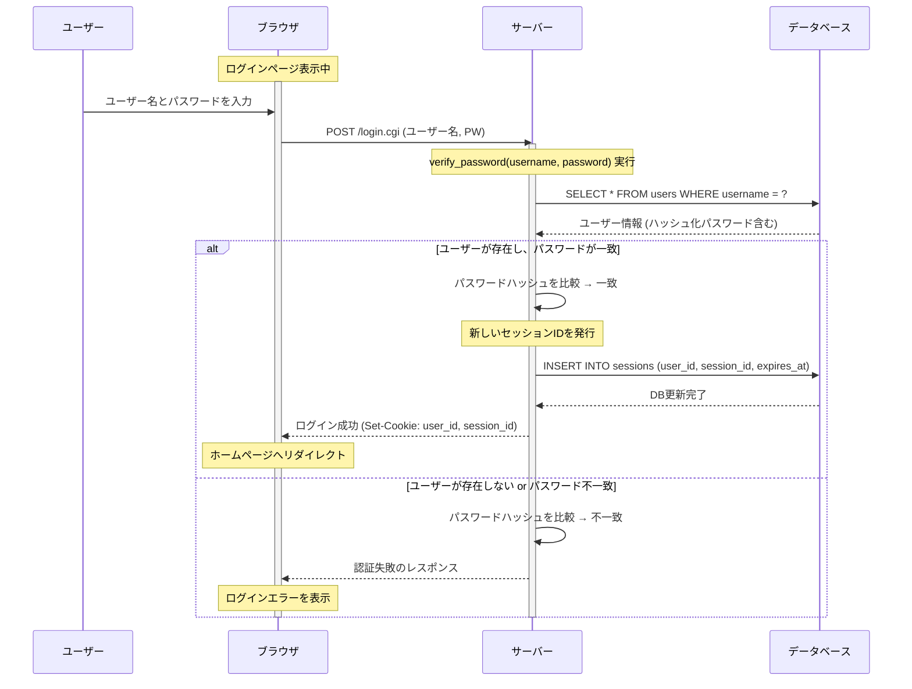
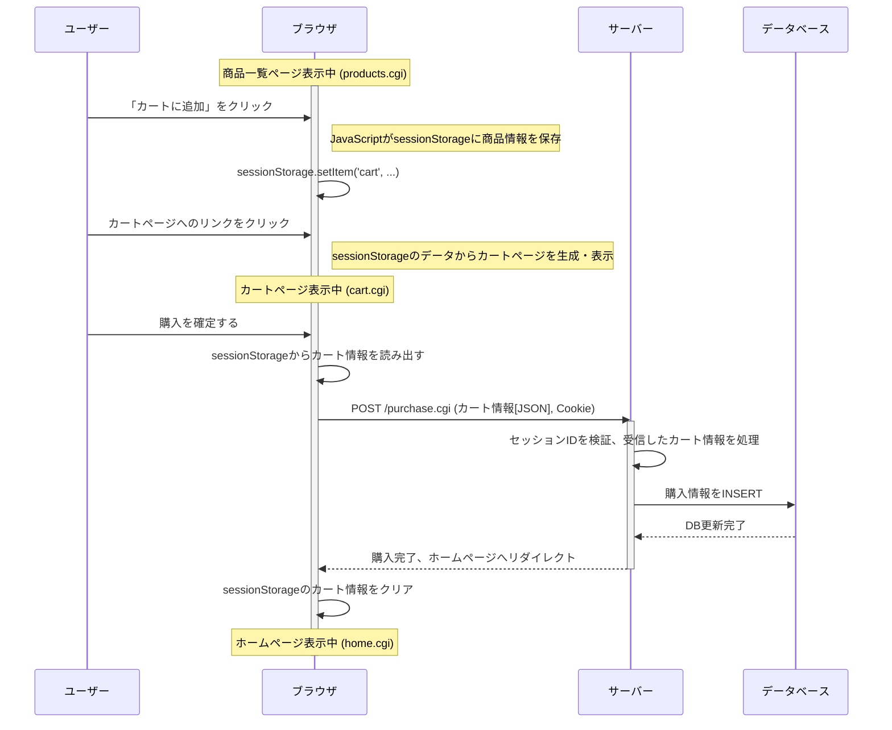
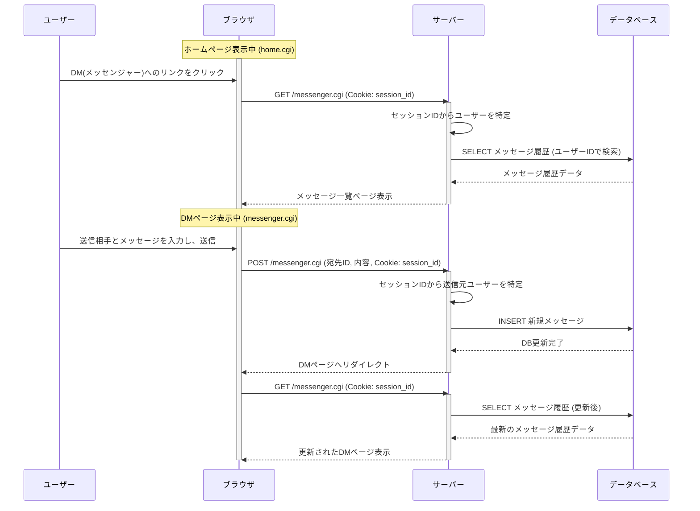
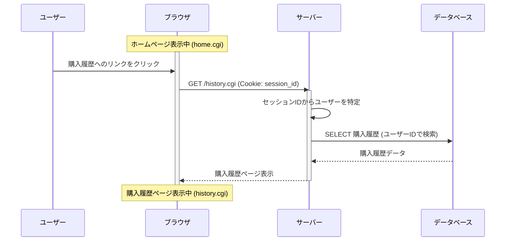

# ログインシーケンス

```mermaid
sequenceDiagram
    participant User as ユーザー
    participant Browser as ブラウザ
    participant Server as サーバー
    participant Database as データベース

    Note over Browser: ログインページ表示中
    activate Browser
    User->>Browser: ユーザー名とパスワードを入力

    Browser->>Server: POST /login.cgi (ユーザー名, PW)
    activate Server
    
    Note over Server: verify_password(username, password) 実行
    Server->>Database: SELECT * FROM users WHERE username = ?
    Database-->>Server: ユーザー情報 (ハッシュ化パスワード含む)
    
    alt ユーザーが存在し、パスワードが一致
        Server->>Server: パスワードハッシュを比較 → 一致
        Note over Server: 新しいセッションIDを発行
        Server->>Database: INSERT INTO sessions (user_id, session_id, expires_at)
        Database-->>Server: DB更新完了
        Server-->>Browser: ログイン成功 (Set-Cookie: user_id, session_id)
        Note over Browser: ホームページへリダイレクト
    else ユーザーが存在しない or パスワード不一致
        Server->>Server: パスワードハッシュを比較 → 不一致
        Server-->>Browser: 認証失敗のレスポンス
        Note over Browser: ログインエラーを表示
    end
    
    deactivate Server
    deactivate Browser
```

# 購入シーケンス

```mermaid
sequenceDiagram
    participant User as ユーザー
    participant Browser as ブラウザ
    participant Server as サーバー
    participant Database as データベース

    %% 前提：ログイン済みで商品一覧ページにいる
    Note over Browser: 商品一覧ページ表示中 (products.cgi)
    activate Browser

    %% 1. 商品をカートに追加 (クライアント処理)
    User->>Browser: 「カートに追加」をクリック
    Note right of Browser: JavaScriptがsessionStorageに商品情報を保存
    Browser->>Browser: sessionStorage.setItem('cart', ...);
    
    %% 2. カートページへ移動
    User->>Browser: カートページへのリンクをクリック
    Note right of Browser: sessionStorageのデータからカートページを生成・表示
    Note over Browser: カートページ表示中 (cart.cgi)

    %% 3. 購入処理
    User->>Browser: 購入を確定する
    Browser->>Browser: sessionStorageからカート情報を読み出す
    Browser->>Server: POST /purchase.cgi (カート情報[JSON], Cookie)
    activate Server
    Server->>Server: セッションIDを検証、受信したカート情報を処理
    Server->>Database: 購入情報をINSERT
    Database-->>Server: DB更新完了
    Server-->>Browser: 購入完了、ホームページへリダイレクト
    deactivate Server
    
    %% 4. 処理完了後
    Browser->>Browser: sessionStorageのカート情報をクリア
    Note over Browser: ホームページ表示中 (home.cgi)
    deactivate Browser
```

# DMシーケンス

```mermaid
sequenceDiagram
    participant User as ユーザー
    participant Browser as ブラウザ
    participant Server as サーバー
    participant Database as データベース

    %% 前提：ユーザーはログイン済みでホームページにいる
    Note over Browser: ホームページ表示中 (home.cgi)
    activate Browser

    %% 1. メッセンジャーページへのアクセス
    User->>Browser: DM(メッセンジャー)へのリンクをクリック
    Browser->>Server: GET /messenger.cgi (Cookie: session_id)
    activate Server
    Server->>Server: セッションIDからユーザーを特定
    Server->>Database: SELECT メッセージ履歴 (ユーザーIDで検索)
    Database-->>Server: メッセージ履歴データ
    Server-->>Browser: メッセージ一覧ページ表示
    deactivate Server
    Note over Browser: DMページ表示中 (messenger.cgi)

    %% 2. メッセージの送信
    User->>Browser: 送信相手とメッセージを入力し、送信
    Browser->>Server: POST /messenger.cgi (宛先ID, 内容, Cookie: session_id)
    activate Server
    Server->>Server: セッションIDから送信元ユーザーを特定
    Server->>Database: INSERT 新規メッセージ
    Database-->>Server: DB更新完了
    Server-->>Browser: DMページへリダイレクト
    deactivate Server
    
    %% 3. 表示の更新
    Browser->>Server: GET /messenger.cgi (Cookie: session_id)
    activate Server
    Server->>Database: SELECT メッセージ履歴 (更新後)
    Database-->>Server: 最新のメッセージ履歴データ
    Server-->>Browser: 更新されたDMページ表示
    deactivate Server
    deactivate Browser
```

# 購入履歴シーケンス

```mermaid
sequenceDiagram
    participant User as ユーザー
    participant Browser as ブラウザ
    participant Server as サーバー
    participant Database as データベース

    %% 前提：ユーザーはログイン済みでホームページにいる
    Note over Browser: ホームページ表示中 (home.cgi)
    activate Browser
    
    %% 購入履歴ページへのアクセスと表示
    User->>Browser: 購入履歴へのリンクをクリック
    Browser->>Server: GET /history.cgi (Cookie: session_id)
    activate Server
    Server->>Server: セッションIDからユーザーを特定
    Server->>Database: SELECT 購入履歴 (ユーザーIDで検索)
    Database-->>Server: 購入履歴データ
    Server-->>Browser: 購入履歴ページ表示
    deactivate Server
    Note over Browser: 購入履歴ページ表示中 (history.cgi)
    deactivate Browser
```